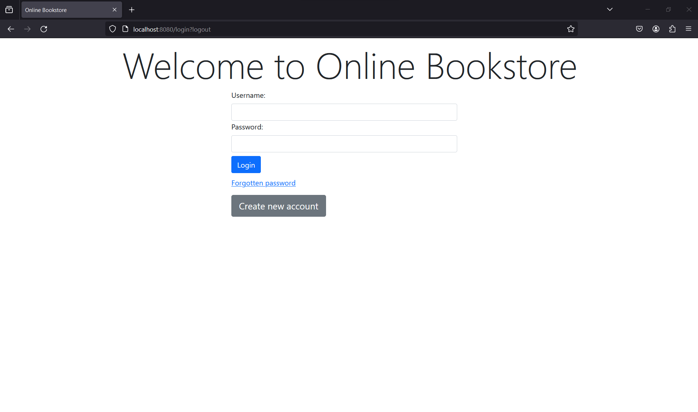
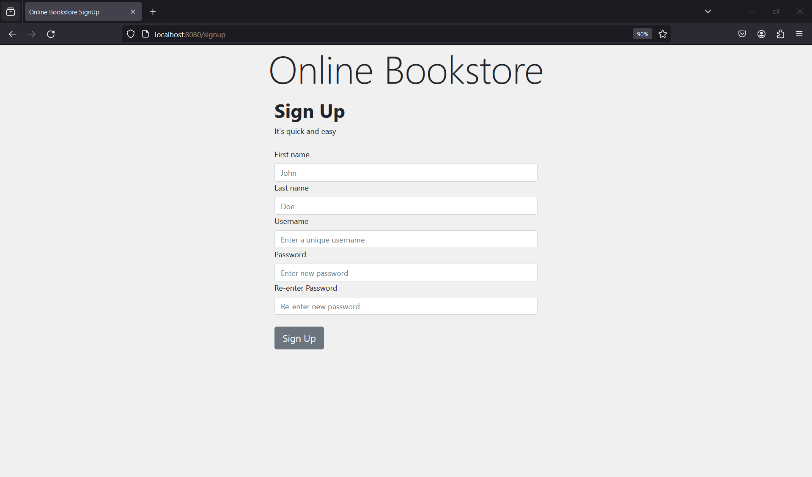

# Read Me First

# Setup

* Clone the repository on your machine
* Create a MySQL database on your local machine
* Change below properties in Application.properties file:
  * spring.datasource.url=jdbc:mysql://localhost:3306/database_name
   * spring.datasource.username=my_username
   * spring.datasource.password=my_password

# App Features

* A registered user would be able to view a list of all the books available in the database
* Registered user can order books by simply adding them to the cart
* Users can check their orders history
* Dedicated admin panel
* Admin can view, delete users and books

 
.png) 



# Technical Details

* Application uses Java 17, Spring MVC, Spring Data JPA, Spring Security, Lombok library, MySQL.
* App interface is built using HTML and Bootstrap CSS
* Thymeleaf is used as the server-side template engine to render views
* Code follows Spring Boot's dependency injection and IoC practices.

# Package Structure

```markdown
com.OnlineBookstore.OnlineBookStore     #root
.|-src
    |-main
        |-java
        |    |-config                                #configuration files
        |    |-constants                             #constants used throughout the project
        |    |-controller                            #controllers for handling requests
        |    |-Dto                                   #handle data transfer objects
        |    |-entity                                #Spring Data JPA entities
        |    |-exception                             #classes to handle exceptions
        |    |-Mapper                                #Map objects to their DTO counterpart
        |    |-repository                            #Extension of JpaRepository to perform CRUD operations
        |    |-service                               #service interfaces
        |        |-impl                              #implementation of service interfaces
        |    |-utils                                 #utility classes
    |-resources
        |-static                                #images
        |-templates                             #HTML files
```

